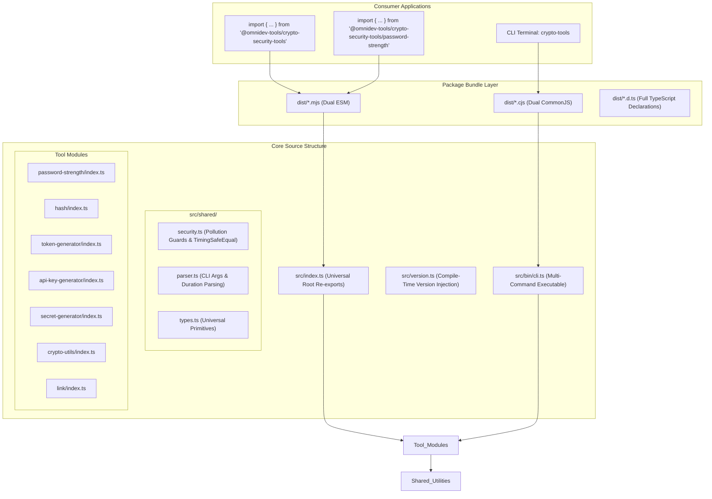

# System Architecture & Technical Design

`@omnidev-tools/crypto-security-tools` is an enterprise-grade utility package and standalone CLI toolkit designed around three foundational principles:
1. **Zero Runtime Dependencies**: Every single tool is built from first principles with zero external dependencies.
2. **Defensive Security by Default**: Built-in defenses against prototype pollution, timing side-channels, and parameter tampering.
3. **Dual Module & Granular Subpaths**: Full tree-shaking support for ESM and CommonJS with TypeScript type declarations.

---

## High-Level Architecture Diagram



---

## Complete Directory Tree

```
SecurityAndCryptoHelperTools/
├── .gitignore
├── LICENSE
├── package.json
├── prompt.md
├── README.md
├── tsconfig.json
├── tsup.config.ts
├── vitest.config.ts
├── docs/
│   ├── ARCHITECTURE.md
│   ├── DEPLOYMENT.md
│   ├── FEATURES.md
│   ├── INSTALLATION.md
│   ├── LIMITATIONS.md
│   └── TESTING.md
└── src/
    ├── index.ts                     # Root re-export of all tools & VERSION
    ├── index.test.ts                # Root export & end-to-end integration tests
    ├── version.ts                   # Injected version export
    ├── version.test.ts              # Package.json version synchronization test
    ├── api-key-generator/
    │   ├── index.ts                 # Prefixed API key generator & checksums
    │   └── index.test.ts            # API key generation & verification test suite
    ├── bin/
    │   ├── cli.ts                   # Standalone multi-command CLI runner
    │   └── cli.test.ts              # CLI flags, piping, and subcommand tests
    ├── crypto-utils/
    │   ├── index.ts                 # Random bytes, ints, floats, Fisher-Yates, encodings
    │   └── index.test.ts            # Crypto-utils unit test suite
    ├── hash/
    │   ├── index.ts                 # SHA-256/384/512, SHA-1, MD5, and HMAC (sync & async)
    │   └── index.test.ts            # RFC hash vectors & HMAC test suite
    ├── link/
    │   ├── index.ts                 # HMAC-signed URLs, tamper-proofing & expiration
    │   └── index.test.ts            # Signed link generation & verification tests
    ├── password-strength/
    │   ├── index.ts                 # Entropy calculation, blacklist, crack times
    │   └── index.test.ts            # Password complexity & pattern matching tests
    ├── secret-generator/
    │   ├── index.ts                 # High-entropy secrets, passphrases, entropy meter
    │   ├── index.test.ts            # Secret generator unit test suite
    │   └── wordlist.ts              # 2048-word Diceware wordlist (11 bits/word)
    ├── shared/
    │   ├── parser.ts                # Zero-dependency argument & duration parser
    │   ├── parser.test.ts           # Parser unit test suite
    │   ├── security.ts              # Prototype pollution guards & timingSafeEqual
    │   ├── security.test.ts         # Security defense unit test suite
    │   └── types.ts                 # Shared universal interfaces & types
    └── token-generator/
        ├── index.ts                 # Alphanumeric, hex, base64url, uuid, nanoid tokens
        └── index.test.ts            # Token generator unit test suite
```

---

## Module Boundaries & Data Flow

1. **Shared Foundation (`src/shared/`)**:
   - `types.ts` contains all TypeScript contracts. No runtime dependencies.
   - `security.ts` provides `safeRecord()` (`Object.create(null)`), `isSafeKey()` filtering `__proto__`, `constructor`, `prototype`, and constant-time string comparison (`timingSafeEqual`).
   - `parser.ts` provides duration parsing (`'15m'`, `'2h'`, `'7d'`) and safe CLI argument parsing.

2. **Tool Modules**:
   - Every tool is completely self-contained within its subfolder.
   - Modules only import primitives from `../shared/` or neighboring low-level tools (e.g., `token-generator` or `crypto-utils`).
   - Circular dependencies are strictly forbidden and verified via compile-time checks.

3. **Version Synchronization (Single Source of Truth)**:
   - `package.json` is the sole authority for package versioning.
   - `tsup.config.ts` and `vitest.config.ts` read `package.json` at build/test time and inject `__PACKAGE_VERSION__`.
   - `src/version.ts` exports `VERSION`.
   - `src/bin/cli.ts` checks `--version` / `-v` before anything else, outputting `VERSION + '\n'`.
   - Running `npm run bump:patch` (or minor/major) automatically synchronizes across all compiled artifacts without touching any code files.
